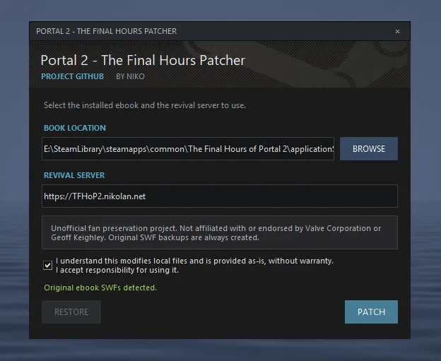

# The Final Hours of Portal 2 - Online Service Reimplementation Patcher

This is my preservation project for *The Final Hours of Portal 2*, the interactive Flash ebook written by Geoff Keighley.

The original ebook still works, but many of its online features disappeared as websites, APIs, and old media players went offline. This project recreates those endpoints with a small FastAPI server so the original ebook can keep using them.

[Download x64 for Windows](https://builds.nikolan.net/download/nikolan123_s_TFHoP2-patcher/latest/windows-patcher/Portal-2-The-Final-Hours-Patcher.exe)

Or run the code directly using `python patcher.py`. Zero extra dependencies.

This program patches The Final Hours of Portal 2 to use my custom servers for it instead of the broken original ones.
The [patcher](https://github.com/nikolan123/TFHoP2-patcher) and [server](https://github.com/nikolan123/TFHoP2-server) are fully open source. Installation instructions are available in the [blog post](https://nikolan.net/posts/portal2/).

Build locally with `./build.ps1` in PowerShell. The executable is written to `dist`.

Unofficial fan preservation project by Niko. Not affiliated with Valve or the original creators.
